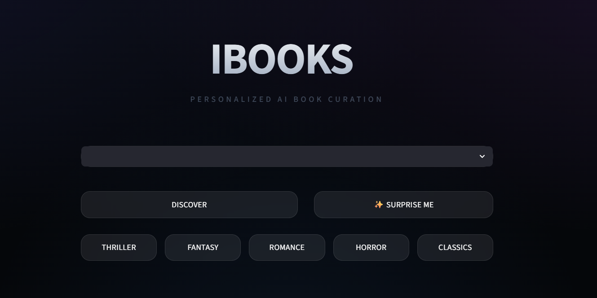
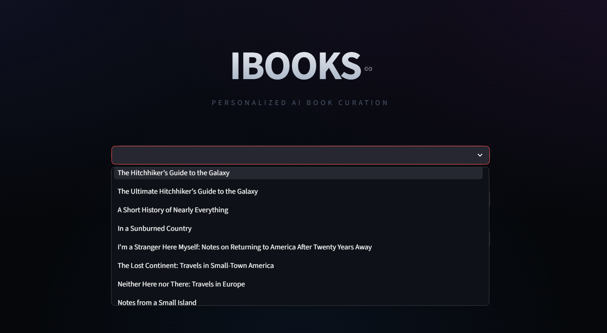
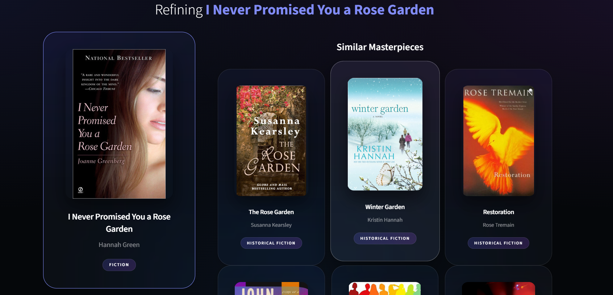
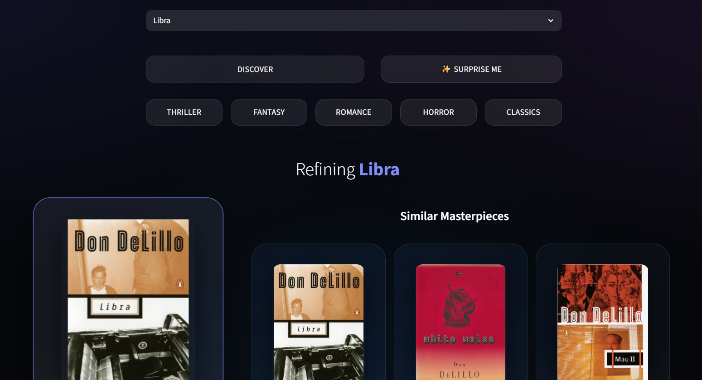

# IBOOKS | Premium AI Book Recommendation System

IBOOKS is a state-of-the-art, content-based book recommendation engine featuring a premium Glassmorphism UI and advanced discovery tools.

## ✨ Key Features
- **Split-View Discover Architecture**: A professional dual-column exploration layout.
- **Dynamic Genre Filtering**: Instantly browse by high-impact categories like **Thriller**, **Horror**, and **Fantasy**.
- **Surprise Me Engine**: Random book generator for serendipitous discovery.
- **Smart Metadata Mapping**: Automatically adapts to various CSV schemas (Book_Details, Google Books, etc.).
- **Premium UI/UX**: Dark-mode Glassmorphism design with custom Outfit typography and animated interactions.
- **Privacy Focused**: Runs entirely on your local machine with no external tracking.

## 🛠️ Technology Stack
- **Python**: Core logic and data processing.
- **Streamlit**: Modern web framework for the interactive UI.
- **Scikit-Learn**: Powering the recommendation engine via **TF-IDF Vectorization** and **K-Nearest Neighbors (KNN)**.
- **Pandas**: Efficient data manipulation and CSV handling.
- **Vanilla CSS**: Custom premium styling and animations.

## 🚀 Installation & Running

### 1. Requirements
Ensure you have Python installed. Then, install the dependencies:
```bash
pip install -r requirements.txt
```

### 2. Launch the Application
Run the following command in your terminal:
```bash
python -m streamlit run app.py
```

### 3. Usage
- **Search**: Use the dropdown to find a specific book.
- **Discover**: Hit the "DISCOVER" button for curated matches.
- **Genres**: Click any genre chip for instant categorical trending books.
- **Surprise Me**: Click the button to let the AI pick a random masterpiece.
- **Home**: Use the HOME button to reset your session anytime.

## 📊 Dataset
The system is optimized for `Book_Details.csv`, which includes high-quality cover images, summaries, and genres. It also supports fallback to `Books.csv` or `google_books_dataset.csv` automatically.

## Live demo
Live Demo:  https://ai-book-recommendation-system-bnicncoua7dx9jnhtziqkh.streamlit.app/
## Screenshots

### Home Page


### Search Feature


### Recommendation


### Discover Feature

---
*Created with ❤️ by Bhavya*
